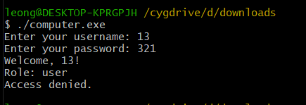
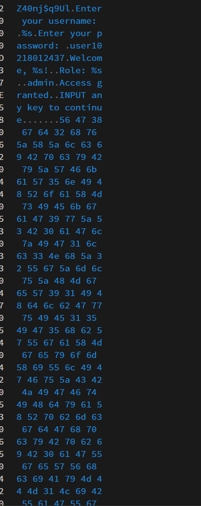
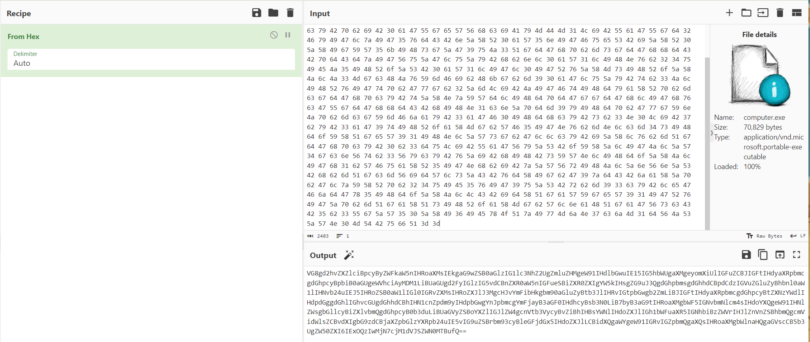
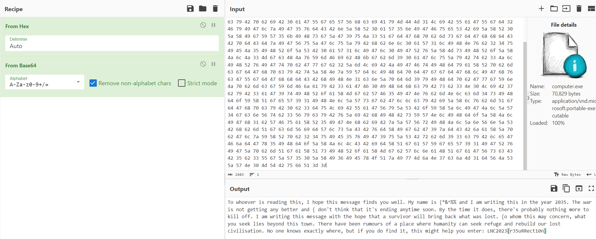
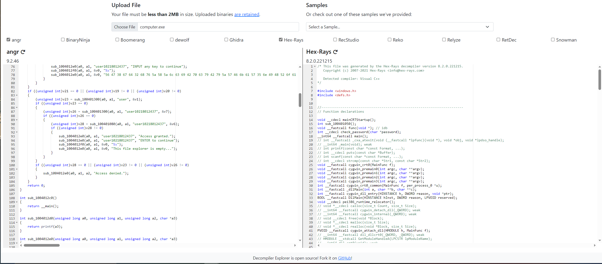
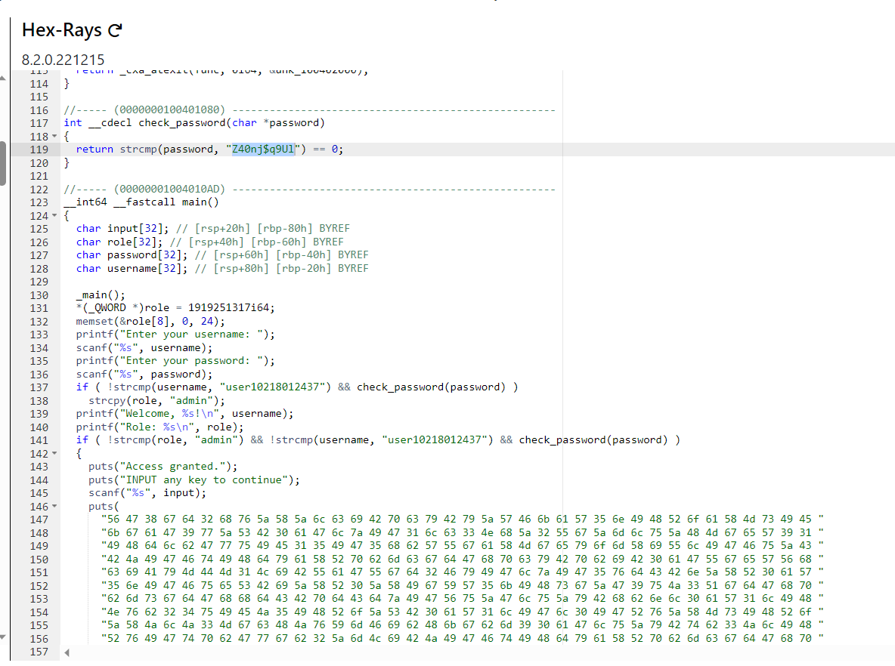
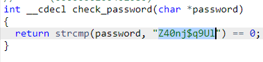

## Lag And Crash 3.0

**CTF Challenge: The Abandoned Computer**

**Category: RE, C asm,crypto**

**Solves: 31**

**Challenge Description:**

You found an old abandoned house with a very old computer that is still working. Hmm... seems like there's nothing inside the computer except for some corrupted files. You managed to find one file that might contain a messsage for you about life before the apocolypse. Can you try accessing the file and uncover the secret message? (To run the unknown file, run the file in the Cygwin terminal.)

`nc hostname 12345`

**Files Provided:**
`computer.exe`

### Approach

This was the first approach I did before I realised decompiling was a thing.

When running the computer.exe on Cygwin terminal, I was greeted with a username and password prompt, guessing the password immediately did not work

However, from another challenge during the same ctf, I realise that putting the exe file into a hex editor/viewer reveals some printf messages, So I did the same for this challenge.

After inserting the file and scrolling down, we can see the print messages when the user keys in the correct username and password, which gives us this long paragraph of hexadecimal numbers.

Copying this paragrah of hexadecimal digits and pasting it into cyberchef gives us what looks like a Base64 string

Further decoding the Base64 String will give us a paragraph and the flag at the end.

Another approach would be to run the computer.exe file into a decompiler and figure out the username and password from there.
For the decompiler , I used an online decompiler,  https://dogbolt.org as it has 6-7 different decompiler methods to choose from, only downside is that its limited to 2MB

From, here Hex-Rays decompiled code looks most promising so lets look at that

So From here, you can either get the username or the password that is in the check_password() function above or just decode the hexadecimal string in the output directly

### Reflections

As this is my 2nd CTF I have ever attended, I could have maybe taken a much faster or better approach and not have wasted time spamming the netcat link in the challenge description early on or just trying to brute force the exe file. But honestly this was a fun and easy challenge that was satisfying to solve.
